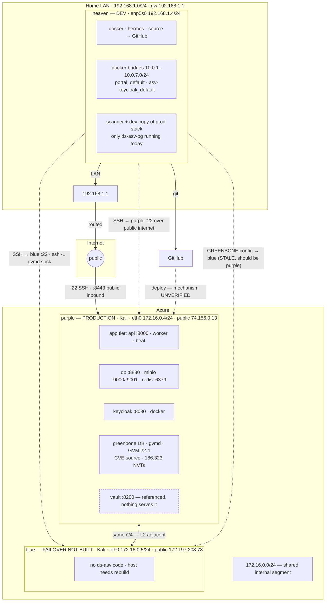

# ds-asv network — diagram source

Status: **partial.** Only user-confirmed facts and verifiable config are drawn. Unknowns are listed, not guessed.
Companion: `network-diagram.html` (rendered sketch), `infra-inventory.md` (full inventory).

## Mermaid

## Edge table

| Edge | Transport | Status |
|---|---|---|
| heaven → gateway | `enp5s0` 192.168.1.4 → 192.168.1.1 | confirmed — routing table |
| gateway → internet | LAN uplink, routed | confirmed |
| internet → purple :22 | SSH, public inbound | confirmed — user description |
| internet → purple :8443 | TLS, public inbound | open — owning service unknown |
| heaven → purple :22 | SSH over public internet | confirmed — route + `/etc/hosts` |
| heaven → blue :22 | SSH + `-L` gvmd unix-socket forward | confirmed — `greenbone.env` |
| purple ↔ blue | `172.16.0.0/24` L2 adjacency | adjacent — no traffic yet |
| heaven → GitHub | git over HTTPS/SSH | confirmed |
| GitHub / heaven → purple | deploy | **mechanism unverified** |
| scanner → gvmd | `GREENBONE_*` | **points at blue — should be purple** |

## Segments

| Segment | Members | Reachability |
|---|---|---|
| `192.168.1.0/24` | heaven `192.168.1.4` | RFC1918 LAN · gw 192.168.1.1 |
| `172.16.0.0/24` | purple `172.16.0.4`, blue `172.16.0.5` | RFC1918 internal · shared by both VPS hosts |
| `10.0.1.0/24` … `10.0.7.0/24` | heaven's Docker bridges | host-local |
| public | purple `74.156.0.13`, blue `172.197.208.78` | internet — interfaces not yet identified |

## Deliberately not drawn

- The interfaces carrying each public IP — neither appears on the `eth0`s provided.
- Whether `172.16.0.0/24` crosses a cloud boundary (VNet peering / VPN) or is a plain Azure VNet.
- CDE boundary, data-flow direction, per-host owners, environment classification.
- Any assumption that heaven and the Azure hosts are reachable except across the internet.
