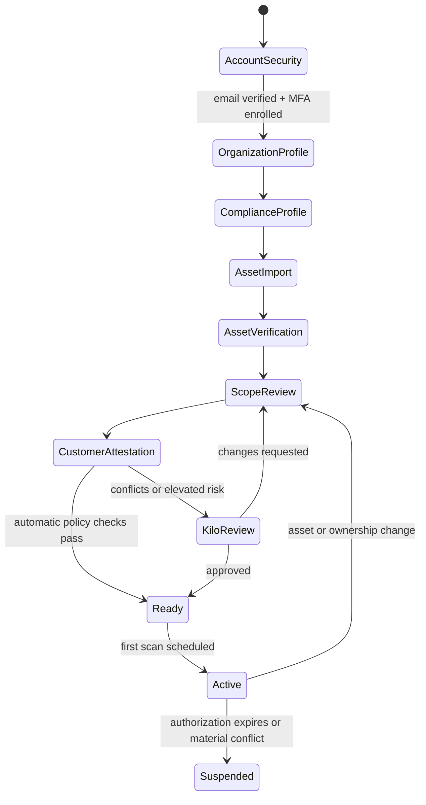
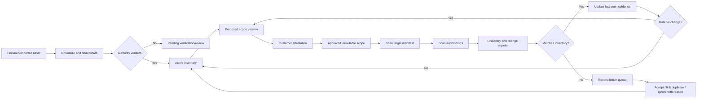

# Kilo ASV Customer Onboarding and Asset Management Design

**Status:** Proposed product and engineering design  
**Research date:** 2026-08-06  
**Scope:** Customer-facing onboarding, external asset inventory, PCI ASV scope approval, and scan initiation

## 1. Executive decision

Kilo should model four different things separately:

1. **Organization** — the customer or merchant and its tenancy boundary.
2. **Asset** — a durable technical object owned or operated by that organization.
3. **Scope version** — a reviewed, time-bound declaration of which assets are authorized and required for an ASV scan.
4. **Scan target** — an immutable snapshot derived from an approved scope version for one scan.

The most important engineering change is therefore:

> Do not use `Target` as the asset inventory. An asset persists across scans; a target records what was actually scanned at a particular time.

The current implementation stores scope as JSON in `Customer.scope_ips` and creates `Target` rows beneath individual scans. This works for scan execution but cannot provide asset lifecycle, ownership verification, approval history, scope versioning, discovery reconciliation, or reliable cross-scan reporting.

## 2. Research findings translated into design rules

### 2.1 Asset inventory is a lifecycle, not a list

NIST CSF 2.0 calls for maintained inventories of hardware, software, services, systems, supplier services, and data; prioritization by criticality; and lifecycle management. It also calls for vulnerabilities to be identified, validated, and recorded.[2] NIST SP 800-53 CM-8 further expects an inventory that accurately reflects the system, avoids duplicate accounting, has sufficient tracking granularity, includes accountability information, and is reviewed and updated at an organization-defined frequency.[3]

**Kilo rule:** every asset needs a stable identity, accountable owner, source, lifecycle state, verification state, criticality, timestamps, and change history.

### 2.2 Declared assets and discovered assets are different

CISA describes asset discovery and vulnerability enumeration as distinct but mutually supporting activities and emphasizes continuous, comprehensive visibility.[4]

**Kilo rule:** store:

- customer-declared assets;
- assets discovered from DNS, scan results, cloud connectors, or imported inventories;
- the reconciliation decision: accepted, duplicate, ignored with reason, or under review.

Discovery must not silently expand authorized scan scope.

### 2.3 Scope and authorization must be explicit and versioned

PCI SSC publishes the controlling ASV Program Guide in its document library.[1] Because Kilo will execute intrusive activity against Internet-facing systems, authorization and the exact approved scope must be durable evidence rather than a checkbox whose later edits overwrite history.

**Kilo rule:** each scope version records its assets, exclusions and rationale, who attested, authorization wording/version, timestamp, source IPs/scanner profile, permitted testing window, and approval status. A scan can only reference an approved immutable version.

> Compliance note: final attestation text, required evidence, dispute handling, report fields, and retention periods must be validated against the current PCI SSC ASV Program Guide and Kilo's legal counsel before production. Product recommendations in this document are not a substitute for ASV program validation.

### 2.4 Tenant context must be enforced server-side

OWASP's multi-tenant guidance recommends establishing tenant context early, deriving it from authenticated identity rather than client-supplied identifiers, including tenant identity in data access and cache keys, validating resource ownership, and logging tenant context.[5] OWASP authorization guidance recommends least privilege, deny-by-default behavior, permission validation on every request, and favors attribute/relationship-aware authorization over simple global roles.[6]

**Kilo rule:** every tenant-owned table carries `organization_id`; repositories/services automatically filter by that ID; URLs cannot grant tenancy; resource ownership is checked on every operation. Use roles plus relationships and attributes.

### 2.5 High-impact users need strong authentication

NIST SP 800-63B describes AAL2 as requiring two distinct factors and requiring an offered phishing-resistant option.[8]

**Kilo rule:** require MFA for customer admins and all Kilo staff; require step-up authentication for scope attestation, credential changes, scan authorization, report attestation, and destructive actions. Prefer passkeys/WebAuthn.

### 2.6 Credentials are references, not asset fields

OWASP secrets-management guidance treats secrets as lifecycle-managed objects that need controlled creation, rotation, revocation, expiration, access logging, and least-privilege access.[7]

**Kilo rule:** store only a `credential_profile_id` or Vault reference. Never return a secret to the browser after creation, copy it into a scan job, place it in logs, or persist it in asset inventory JSON.

## 3. Recommended customer experience

### 3.1 Onboarding state machine



Onboarding progress should be resumable. Each step has a server-side status; the UI never infers completion merely from visited screens.

### 3.2 Detailed flow

#### Step 1 — Secure the account

Customer:

- accepts a single-use, expiring invitation;
- verifies email;
- enrolls MFA/passkey;
- accepts terms and privacy notices.

System:

- creates the user only inside the invited organization;
- invalidates the invitation atomically;
- records consent document versions;
- emits audit events.

#### Step 2 — Create the organization profile

Collect:

- legal and trading name;
- company/merchant identifier where applicable;
- primary country and timezone;
- business, security, billing, and emergency contacts;
- acquirer and merchant level;
- expected scan cadence and preferred maintenance window.

Do not overload one `contact_email` field. Contacts should be independent records with purpose and escalation order.

#### Step 3 — Capture the compliance profile

Ask plain-language questions that determine the workflow, not a giant generic questionnaire:

- Is this for PCI ASV quarterly scanning?
- Is the organization a merchant, service provider, or managed customer?
- Which acquirer or requesting entity receives the result?
- Are public services hosted directly, by a cloud provider, or by a managed provider?
- Are shared-hosting or third-party assets included?

The profile suggests scope but does not decide it automatically.

#### Step 4 — Add assets

Support three paths:

1. manual entry;
2. CSV import with preview and error report;
3. connector/discovery ingestion later.

MVP asset types:

- IPv4 address;
- IPv6 address;
- CIDR range;
- FQDN/domain;
- public web/API endpoint.

Normalize before comparing:

- canonical IP representation;
- lower-case/punycode FQDN with trailing dot removed;
- CIDR network boundaries normalized;
- URL scheme, host, port, and path separated;
- duplicates detected within and across organizations without exposing another tenant's identity.

For each asset collect:

- display name and canonical identifier;
- asset owner/contact;
- environment (`production`, `staging`, `development`);
- business service and criticality;
- hosting/provider and location;
- Internet exposure;
- source and discovery timestamp;
- tags;
- requested scope status;
- optional parent asset or range.

#### Step 5 — Verify control and scanning authority

Verification is evidence that reduces mistakes; legal authorization remains a separate attestation.

Offer suitable methods by asset type:

- DNS TXT challenge for domains;
- HTTP well-known challenge for web endpoints;
- approved email/domain verification;
- cloud-account connector evidence;
- ISP/cloud allocation document or signed letter of authorization;
- manual analyst review for IPs, shared infrastructure, and third-party hosting.

Verification state:

`unverified -> pending -> verified | rejected | expired`

Record method, challenge/evidence reference, verifier, and validity period. Verification tokens must be random, single-purpose, hashed at rest where applicable, and expire.

If an identifier is already claimed by another tenant, do not reveal that tenant. Place the claim into a confidential conflict-review queue.

#### Step 6 — Build and review a scope version

The scope builder presents:

- included assets;
- excluded or inactive assets;
- unresolved discovered assets;
- overlapping/duplicate ranges;
- DNS resolution and hosting changes;
- verification status;
- previous-scope differences;
- scan safety/availability notes.

Block submission when:

- scope is empty;
- any item is malformed;
- a required ownership/authority check is unresolved;
- ranges overlap inconsistently;
- an exclusion has no rationale;
- the authorization window has expired.

Warn, but allow controlled analyst review, for dynamic DNS, CDNs, shared hosting, very large CIDRs, third-party assets, and recently changed ownership.

#### Step 7 — Attest and authorize

The authorized customer representative reviews a human-readable summary and attests that:

- the inventory and scope are complete to the best of their knowledge;
- Kilo is authorized to perform the specified testing;
- third-party permissions have been obtained;
- exclusions and constraints are accurate;
- contacts and permitted windows are correct.

Require step-up authentication. Store an immutable attestation containing the rendered statement hash, statement version, scope-version hash, signer, role, timestamp, source IP, and user agent.

#### Step 8 — Preflight and activate

System preflight:

- re-resolves DNS and records the answer set;
- checks suppression/deny lists and internal safety policy;
- estimates host count from ranges;
- validates scan windows and emergency contact;
- confirms authorization has not expired;
- creates an immutable target manifest;
- requests staff review only when policy requires it.

Activation creates the first scheduled scan. It never mutates the approved scope.

## 4. Ongoing asset-management flow



### Asset lifecycle

Recommended states:

- `draft` — not yet submitted;
- `pending_verification`;
- `active`;
- `suspended` — temporarily blocked from new scopes;
- `retiring` — removal awaiting scope impact review;
- `retired` — retained historically, not selectable;
- `rejected` — invalid or unauthorized claim.

Never hard-delete an asset that appears in an attested scope, scan, finding, report, or audit event.

### Change rules

A material change creates a new review task and may require a new scope version:

- canonical IP/FQDN change;
- ownership, hosting provider, or authority change;
- exposure changes from internal to public;
- range expansion;
- criticality/business-service change;
- verification expiration;
- DNS starts resolving outside the approved address set;
- scanner discovery identifies an untracked related endpoint.

Cosmetic changes such as display name or tags do not invalidate a scope, but are still audited.

## 5. Portal information architecture

Customer navigation:

1. **Overview** — onboarding status, next scan, scope health, unresolved actions.
2. **Assets** — canonical inventory, import, verification, lifecycle, discovery inbox.
3. **Scope** — draft/current/history/diff, exclusions, attestation.
4. **Scans** — schedule, live status, immutable target manifest, rescan.
5. **Findings** — vulnerability lifecycle, evidence, dispute/remediation.
6. **Reports** — generated and attested reports.
7. **Team** — invitations, roles, MFA and access review.
8. **Audit** — customer-visible security and workflow events.
9. **Settings** — organization, contacts, integrations, notification policy.

Kilo staff should use a separate operations workspace with explicit cross-tenant privileges and reason-captured support access. Do not implement an invisible “impersonate customer” shortcut.

## 6. Proposed domain model

All mutable entities include `id`, `organization_id`, `created_at`, `updated_at`, and optimistic version where appropriate. Audit events are append-only.

| Entity | Purpose | Important fields |
|---|---|---|
| `organizations` | Tenant/customer boundary | legal_name, trading_name, status, timezone, acquirer, merchant_level |
| `users` | Human identity | email, name, status, MFA state; no single global customer role |
| `organization_memberships` | User-to-tenant relationship | user_id, organization_id, role, status |
| `contacts` | Purpose-specific contacts | type, name, email, phone, escalation_order |
| `compliance_profiles` | Program context | program, entity_type, requesting_entity, cadence |
| `assets` | Durable inventory object | type, canonical_identifier, display_name, owner, environment, criticality, lifecycle_state, verification_state, source, last_seen_at |
| `asset_addresses` | Address/DNS history | asset_id, address, valid_from, valid_to, source |
| `asset_relationships` | Domain/range/service relationships | parent_id, child_id, relation_type, confidence |
| `asset_verifications` | Control/authority evidence | asset_id, method, status, challenge_hash/evidence_ref, verified_by, expires_at |
| `asset_observations` | Discovery evidence | source, observed_identifier, first_seen, last_seen, payload_ref, reconciliation_status |
| `scope_sets` | Logical ASV scope | name, program, current_version_id |
| `scope_versions` | Immutable submitted scope | version, status, previous_version_id, submitted_by, approved_by, valid_from/to, content_hash |
| `scope_items` | Asset/range in one version | scope_version_id, asset_id, inclusion, reason, constraints snapshot |
| `authorizations` | Signed customer authority | scope_version_id, signer, statement_version, statement_hash, signature metadata |
| `scan_jobs` | Execution request | scope_version_id, type, schedule, status, initiated_by |
| `scan_targets` | Immutable execution snapshot | scan_job_id, asset_id, hostname/IP/port at dispatch, resolved addresses, auth profile ref |
| `credential_profiles` | Metadata and Vault pointer | type, vault_ref, owner, status, expires_at, last_tested_at |
| `findings` | Vulnerability records | scan_target_id, fingerprint, severity, status, evidence refs |
| `audit_events` | Security/workflow history | tenant, actor, action, resource, before/after refs, request/correlation IDs, reason, timestamp |

### Key constraints

- Unique active asset: `(organization_id, asset_type, canonical_identifier)`.
- Every tenant-owned foreign-key relation must remain inside one organization.
- `scope_versions` and their items become immutable at submission.
- `scan_targets` become immutable at dispatch.
- An approved scope requires at least one included item and one valid authorization.
- A scan job must reference exactly one approved scope version.
- Credential secret values never exist in this database.
- Retire rather than delete referenced assets.

## 7. Roles and permissions

Start with these tenant roles:

| Role | Abilities |
|---|---|
| `organization_owner` | Manage organization, admins, legal authorization, and all workflows |
| `security_admin` | Manage assets, scope, scans, credentials, findings, and reports |
| `asset_manager` | Add/update assets and submit verification; cannot attest scope |
| `scan_operator` | Schedule approved scopes and view scan diagnostics |
| `report_viewer` | Read findings and reports only |
| `billing_admin` | Billing only |

Kilo staff roles should be separate: support, analyst, ASV reviewer, compliance manager, platform admin. Enforce separation of duties for sensitive approvals where policy requires it.

Permission checks should use action + resource + tenant relationship + state. Example:

`can(user, "scope.attest", scope_version)` requires an active membership, permitted role, MFA/step-up freshness, scope status `submitted`, and no conflict of interest.

## 8. API shape

Use organization context derived from the authenticated session. The `{organization_id}` in internal service calls is a routing aid, never the source of authorization.

```text
POST   /v1/invitations/accept
GET    /v1/onboarding
PATCH  /v1/onboarding/organization
PATCH  /v1/onboarding/compliance-profile

GET    /v1/assets
POST   /v1/assets
POST   /v1/assets/imports
GET    /v1/assets/imports/{id}
PATCH  /v1/assets/{id}
POST   /v1/assets/{id}/verification-challenges
POST   /v1/assets/{id}/retire
GET    /v1/asset-observations
POST   /v1/asset-observations/{id}/reconcile

POST   /v1/scope-sets
POST   /v1/scope-sets/{id}/versions
GET    /v1/scope-versions/{id}/diff
POST   /v1/scope-versions/{id}/submit
POST   /v1/scope-versions/{id}/attest
POST   /v1/scope-versions/{id}/approve

POST   /v1/scan-jobs
GET    /v1/scan-jobs/{id}/target-manifest
GET    /v1/audit-events
```

Use idempotency keys for invitations, imports, verification challenge creation, scope submission, attestation, and scan creation. Async imports/scans return operation IDs. Every write accepts/returns a correlation ID.

## 9. Security and operational controls

- Enforce tenant filters in a shared repository/data-access layer; add database row-level security if PostgreSQL is used.
- Include `organization_id` in cache keys, object-storage prefixes, queue messages, search indexes, metrics dimensions, and signed download claims.
- Deny by default and authorize every object operation.
- Require MFA and recent step-up for high-impact actions.
- Rate-limit invitations, verification attempts, imports, exports, and scan submissions.
- Encrypt transport and storage; use per-environment managed keys and narrowly scoped service identities.
- Put credentials in Vault and issue short-lived leases to workers where possible.
- Make audit events tamper-evident/append-only and export security events to the SIEM.
- Virus-scan and content-validate uploads; keep raw evidence out of application logs.
- Separate control plane from scan workers. Workers receive a signed, minimal, expiring job manifest.
- Record all scope and target hashes so a report can prove exactly what was authorized and scanned.
- Implement retention by artifact class after PCI/legal validation, with litigation hold support and cryptographic deletion where appropriate.

## 10. Changes needed in the current Kilo code

### Current strengths

- `Customer` already captures merchant/acquirer context.
- Scope authorization is CIDR-aware and rejects empty/out-of-scope scan targets.
- `Scan` already references a customer and keeps a credential reference rather than a credential value.
- `Target`, `Finding`, and `Evidence` provide a workable execution/result layer.
- The earlier portal design correctly separates the control plane, scanner execution, Vault, evidence, and reporting.

### Gaps to close

1. `Customer.scope_ips` is mutable JSON rather than a relational, versioned scope.
2. `Target` belongs only to `Scan`; there is no persistent asset inventory.
3. Customer APIs use a bearer token but do not provide tenant-aware memberships or per-resource authorization.
4. `list_customers` is global, which is unsafe for a customer-facing multi-tenant portal.
5. There are no invitations, MFA states, contacts, verification evidence, authorization attestations, scope approvals, asset history, reconciliation, or audit events.
6. Inventory remains a JSON blob on `Target`, preventing lifecycle queries and cross-scan change tracking.
7. The separate `asv-auth` user role is global (`admin`, `analyst`, `viewer`) rather than an organization membership.

### Migration approach

Do not delete the execution models. Introduce the new control-plane entities alongside them:

- rename product terminology from customer to organization while retaining a compatibility migration;
- create `assets`, `scope_*`, memberships, contacts, authorizations, and audit tables;
- migrate each valid `Customer.scope_ips` entry into an asset and an initial imported scope version;
- add nullable `asset_id` and required scope snapshot fields to future `Target` rows;
- keep old scans readable without pretending historical targets had verified asset identities;
- deprecate direct `scope_ips` writes after migration validation.

## 11. Phased engineering plan

### Phase 0 — Policy decisions and threat model

Before coding:

- confirm Kilo's ASV role and current PCI SSC program obligations;
- approve authorization and attestation text;
- define retention, support access, tenant conflict, and emergency-stop policies;
- threat-model tenant isolation, scope tampering, SSRF, abusive scanning, credential theft, report leakage, and worker compromise.

**Exit:** signed product/security decision record and abuse-case test plan.

### Phase 1 — Tenant and identity foundation

Build organizations, memberships, invitations, contacts, RBAC/ABAC service, MFA/step-up integration, and append-only audit events.

**Exit:** automated tests prove users cannot read or mutate another tenant's object, including guessed IDs, exports, cache entries, and async jobs.

### Phase 2 — Asset inventory MVP

Build canonical assets, normalization, CSV preview/import, duplicate detection, lifecycle, ownership contacts, list/filter/detail UI, and verification workflow.

**Exit:** imports are idempotent; invalid rows are downloadable; duplicates do not create extra assets; retiring referenced assets preserves history.

### Phase 3 — Versioned scope and authorization

Build scope drafts, versions, diffs, validation, exclusions, attestation, analyst review, and immutable hashes.

**Exit:** no scan can start without an approved version; changes after submission create a new version; authorization evidence can be reproduced.

### Phase 4 — Connect scan execution

Generate immutable `scan_targets` from approved scope, sign the target manifest, dispatch workers, reconcile results to assets, and retain exact resolution/address evidence.

**Exit:** every finding/report traces to asset -> scope item -> scope version -> authorization -> scan target.

### Phase 5 — Continuous reconciliation

Add discovery inbox, DNS/address drift, cloud/CMDB connectors, ownership expiration, scheduled review, stale-asset signals, and bulk remediation.

**Exit:** unknown observations never auto-enter authorized scope; all changes are explainable and auditable.

### Phase 6 — Authenticated scanning integration

Attach Vault-backed credential profiles and the standalone/internal authenticated-scanner module. Keep consent, credential lease, data minimization, and scanner isolation controls established in the prior architecture.

**Exit:** no reusable secret reaches the portal database or logs; workers receive only least-privilege, expiring access; revocation stops future jobs.

## 12. MVP boundary

For the first useful release, build only:

- one organization per invited user initially, but use the membership model from day one;
- organization profile and contacts;
- IPv4, IPv6, CIDR, and FQDN assets;
- manual and CSV asset creation;
- DNS/manual verification;
- one versioned external-ASV scope;
- customer attestation plus optional Kilo review;
- scan target generation from approved scope;
- audit history and scope diff.

Defer cloud connectors, CMDB sync, billing, sophisticated discovery, internal devices, credential profiles, and authenticated scans. This prevents the onboarding project from turning into a full CMDB before its compliance-critical path works.

## 13. Success measures

Track:

- median time from invitation to approved scope;
- percentage completing onboarding without staff assistance;
- invalid/duplicate import rate;
- percentage of assets verified;
- unresolved discovery and ownership-conflict age;
- scope changes detected before scan versus after failure;
- scans blocked for missing/expired authorization;
- cross-tenant authorization test coverage and incidents;
- support touches per onboarded customer;
- quarterly scope reconfirmation completion rate.

## 14. Recommended next design activity

Create clickable wireframes for these five screens before changing the backend:

1. onboarding checklist;
2. asset import preview and inventory;
3. asset verification drawer;
4. scope builder with previous-version diff;
5. final authorization/attestation review.

Validate the flow with one Kilo analyst and two representative customers. Then freeze Phase 1–3 acceptance criteria and produce the database migration/API implementation plan.

## Sources

[1] PCI Security Standards Council, ASV document library and current ASV Program Guide: https://www.pcisecuritystandards.org/document_library/?category=asv&document=asv_program_guide

[2] NIST, *The NIST Cybersecurity Framework (CSF) 2.0*, ID.AM and ID.RA, 2024: https://nvlpubs.nist.gov/nistpubs/CSWP/NIST.CSWP.29.pdf

[3] NIST, *SP 800-53 Rev. 5 — Security and Privacy Controls for Information Systems and Organizations*, CM-8 System Component Inventory: https://nvlpubs.nist.gov/nistpubs/SpecialPublications/NIST.SP.800-53r5.pdf

[4] CISA, *BOD 23-01: Improving Asset Visibility and Vulnerability Detection on Federal Networks*: https://www.cisa.gov/news-events/directives/bod-23-01-improving-asset-visibility-and-vulnerability-detection-federal-networks

[5] OWASP, *Multi-Tenant Security Cheat Sheet*: https://cheatsheetseries.owasp.org/cheatsheets/Multi_Tenant_Security_Cheat_Sheet.html

[6] OWASP, *Authorization Cheat Sheet*: https://cheatsheetseries.owasp.org/cheatsheets/Authorization_Cheat_Sheet.html

[7] OWASP, *Secrets Management Cheat Sheet*: https://cheatsheetseries.owasp.org/cheatsheets/Secrets_Management_Cheat_Sheet.html

[8] NIST, *SP 800-63B — Authentication and Authenticator Management*: https://pages.nist.gov/800-63-4/sp800-63b.html

## Source-strength note

NIST, CISA, and PCI SSC are primary/official sources. OWASP cheat sheets are practitioner guidance. CISA BOD 23-01 is binding on U.S. federal civilian agencies, not Kilo or its customers; it is used here as a strong operational reference for asset visibility, not as a Kilo compliance obligation.
